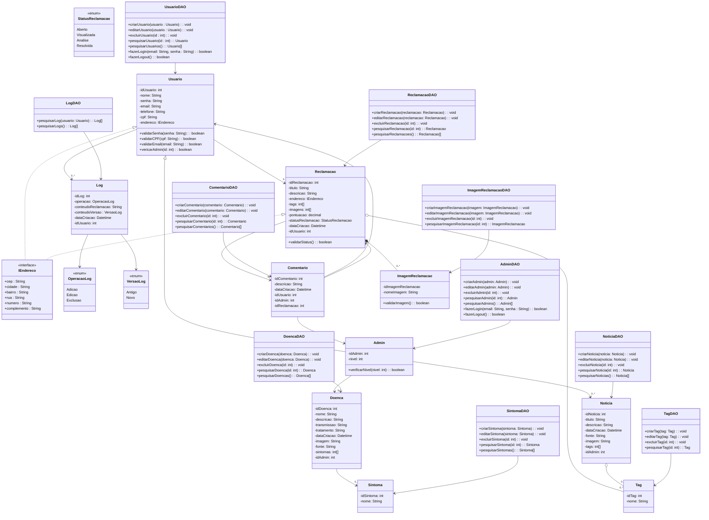

```mermaid
classDiagram

%% Interfaces
class IEndereco {
  <<interface>>
  +cep : String
  +cidade : String
  +bairro : String
  +rua : String
  +numero : String
  +complemento : String
}

%% Enums
class OperacaoLog {
  <<enum>>
  Adicao
  Edicao
  Exclusao
}

class VersaoLog {
  <<enum>>
  Antigo
  Novo
}

class StatusReclamacao {
  <<enum>>
  Aberto
  Visualizada
  Analise
  Resolvida
}

%% Classes principais
class Usuario {
  -idUsuario: int
  -nome: String
  -senha: String
  -email: String
  -telefone: String
  -cpf: String
  -endereco: IEndereco
  +validarSenha(senha: String): boolean
  +validarCPF(cpf: String): boolean
  +validarEmail(email: String): boolean
  +vericarAdmin(id: int): boolean
}

class UsuarioDAO {
  +criarUsuario(usuario : Usuario): void
  +editarUsuario(usuario : Usuario): void
  +excluirUsuario(id : int): void
  +pesquisarUsuario(id : int): Usuario
  +pesquisarUsuarios(): Usuario[]
  +fazerLogin(email: String, senha : String): boolean
  +fazerLogout(): boolean
}

class Admin {
  -idAdmin: int
  -nivel: int
  +verificarNivel(nivel: int): boolean
}

class AdminDAO {
  +criarAdmin(admin: Admin): void
  +editarAdmin(admin: Admin): void
  +excluirAdmin(id: int): void
  +pesquisarAdmin(id: int): Admin
  +pesquisarAdmins(): Admin[]
  +fazerLogin(email: String, senha : String): boolean
  +fazerLogout(): boolean
}

class Log {
  -idLog: int
  -operacao: OperacaoLog
  -conteudoReclamacao: String
  -conteudoVersao : VersaoLog
  -dataCriacao: Datetime
  -idUsuario: int
}

class LogDAO {
  +pesquisarLog(usuario: Usuario): Log[]
  +pesquisarLogs(): Log[]
}

class Reclamacao {
  -idReclamacao: int
  -titulo: String
  -descricao: String
  -endereco: IEndereco
  -tags: int[]
  -imagens: int[]
  -pontuacao: decimal
  -statusReclamacao: StatusReclamacao
  -dataCriacao: Datetime
  -idUsuario: int
  +validarStatus(): boolean
}

class ReclamacaoDAO {
  +criarReclamacao(reclamacao: Reclamacao): void
  +editarReclamacao(reclamacao: Reclamacao): void
  +excluirReclamacao(id: int): void
  +pesquisarReclamacao(id: int): Reclamacao
  +pesquisarReclamacoes(): Reclamacao[]
}

class Comentario {
  -idComentario: int
  -descricao: String
  -dataCriacao: Datetime
  -idUsuario: int
  -idAdmin: int
  -idReclamacao: int
}

class ComentarioDAO {
  +criarComentario(comentario: Comentario): void
  +editarComentario(comentario: Comentario): void
  +excluirComentario(id: int): void
  +pesquisarComentario(id: int): Comentario
  +pesquisarComentarios(): Comentario[]
}

class ImagemReclamacao {
  -idImagemReclamacao
  -nomeImagem: String
  +validarImagem(): boolean
}

class ImagemReclamacaoDAO {
  +criarImagemReclamacao(imagem: ImagemReclamacao): void
  +editarImagemReclamacao(imagem: ImagemReclamacao): void
  +excluirImagemReclamacao(id: int): void
  +pesquisarImagemReclamacao(id: int): ImagemReclamacao
}

class Tag {
  -idTag: int
  -nome: String
}

class TagDAO {
  +criarTag(tag: Tag): void
  +editarTag(tag: Tag): void
  +excluirTag(id: int): void
  +pesquisarTag(id: int): Tag
}

class Doenca {
  -idDoenca: int
  -nome: String
  -descricao: String
  -transmissao: String
  -tratamento: String
  -dataCriacao: Datetime
  -imagem: String
  -fonte: String
  -sintomas: int[]
  -idAdmin: int
}

class DoencaDAO {
  +criarDoenca(doenca: Doenca): void
  +editarDoenca(doenca: Doenca): void
  +excluirDoenca(id: int): void
  +pesquisarDoenca(id: int): Doenca
  +pesquisarDoencas(): Doenca[]
}

class Sintoma {
  -idSintoma: int
  -nome: String
}

class SintomaDAO {
  +criarSintoma(sintoma: Sintoma): void
  +editarSintoma(sintoma: Sintoma): void
  +excluirSintoma(id: int): void
  +pesquisarSintoma(id: int): Sintoma
  +pesquisarSintomas(): Sintoma[]
}

class Noticia {
  -idNoticia: int
  -titulo: String
  -descricao: String
  -dataCriacao: Datetime
  -fonte: String
  -imagem: String
  -tags: int[]
  -idAdmin: int
}

class NoticiaDAO {
  +criarNoticia(noticia: Noticia): void
  +editarNoticia(noticia: Noticia): void
  +excluirNoticia(id: int): void
  +pesquisarNoticia(id: int): Noticia
  +pesquisarNoticias(): Noticia[]
}

%% Relações de herança e implementação
Usuario <|-- Admin
Usuario <|.. IEndereco
Reclamacao <|.. IEndereco

%% Composição e associações
Usuario --> "0..*" Reclamacao
Usuario --> "0..*" Log
Admin --> "0..*" Doenca
Admin --> "0..*" Noticia

Comentario --> Usuario
Comentario --> Admin
Comentario --> Reclamacao

Reclamacao o-- "0..*" Tag
Reclamacao *-- "0..*" ImagemReclamacao
Reclamacao --> "0..*" Comentario

Doenca --> "0..*" Sintoma
Noticia o-- "0..*" Tag

Log --> OperacaoLog
Log --> VersaoLog

UsuarioDAO --> Usuario
AdminDAO --> Admin
LogDAO --> Log
ReclamacaoDAO --> Reclamacao
ComentarioDAO --> Comentario
ImagemReclamacaoDAO --> ImagemReclamacao
TagDAO --> Tag
DoencaDAO --> Doenca
SintomaDAO --> Sintoma
NoticiaDAO --> Noticia

```
