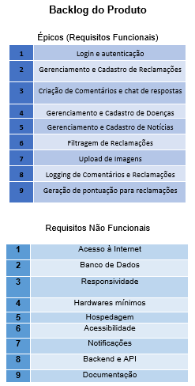
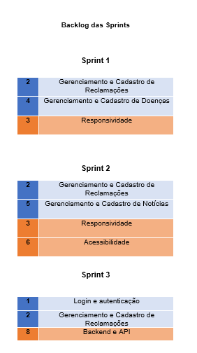
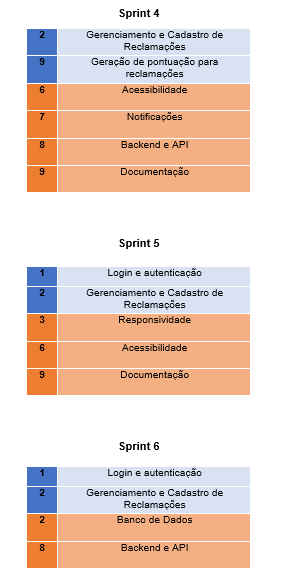
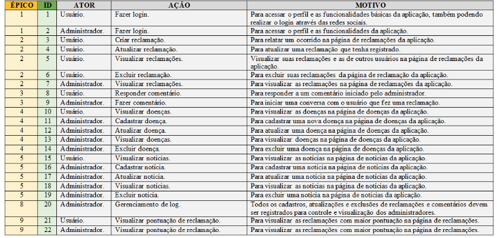

---

    <a href="#sobre">Sobre</a>  |  
    <a href="#backlogs">Backlogs & User Stories</a>  |  
    <a href="#prototipo">Protótipo & Documentação</a>  |  
    <a href="#tecnologias">Tecnologias</a>  |  
    <a href="#equipe">Equipe</a> |
    <a href="#doc-geral">Documentação Geral</a>

# Sobre o projeto

O **SaneaSP** é um sistema desenvolvido para auxiliar a prefeitura ou o órgão responsável pelo saneamento básico e pela gestão hídrica de uma cidade. Sua principal função é disponibilizar, de forma rápida e organizada, comentários e denúncias da população sobre problemas relacionados ao saneamento na região. Dessa forma, o sistema atua como um centro de informações para os responsáveis, promovendo uma gestão mais eficaz e responsiva.

## Backlogs & User Stories

## Protótipo e Documentação

Durante o desenvolvimento do **SaneaSP**, foi criado um protótipo funcional alinhado às ODS 6 e 3. A aplicação permite que qualquer cidadão denuncie problemas relacionados ao saneamento em sua região, promovendo maior participação social.

A interface foi construída com **Bootstrap**, garantindo uma boa experiência de uso em qualquer dispositivo. O front-end, estruturado com **Angular**, oferece uma aplicação moderna, modular e de fácil manutenção.

A documentação técnica foi desenvolvida com a ferramenta **Astah**, incluindo diagramas de casos de uso, modelagem de dados e fluxos de navegação. Todo o material está disponível em um **guia em PDF**, servindo como referência para manutenções e melhorias futuras.

## 🛠️ Tecnologias

As seguintes ferramentas, linguagens, bibliotecas e tecnologias foram usadas na construção do projeto:

 

 
 	
  
 
 

## Equipe:

|    Função     | Nome                                  |                                                                                                                                                      LinkedIn & GitHub                                                                                                                                                      |
| :-----------: | :------------------------------------ | :-------------------------------------------------------------------------------------------------------------------------------------------------------------------------------------------------------------------------------------------------------------------------------------------------------------------------: |
| Desenvolvedor | Davy Oliveira Ribeiro           |                    |
| Desenvolvedor  | Matheus Augusto Santos Gueff |            |
|   Desenvolvedor    | Pedro Silva Martins               |                  |
|   Desenvolvedor   | Ryan Carlo Negretti Pereira                   |                  |

# Documentação Geral

### Repositórios do Projeto
- 🔗 [Back-End](https://github.com/RyanCNP/Backend-SaneaSP.git)  
- 🔗 [Front-End](https://github.com/MathGueff/FrontEnd-SaneaSP.git)  
- 📄 [Documentação](https://github.com/MathGueff/Documentacao-SaneaSP.git)

### Justificativa

O projeto foi baseado nos Objetivos de Desenvolvimento Sustentável (ODS) de número 6 — *Água Potável e Saneamento* — e 3 — *Saúde e Bem-Estar*. Essas metas possuem uma relação direta de causa e consequência: comunidades com acesso adequado ao saneamento básico e à água potável estão menos expostas a doenças.

Apesar da existência de infraestrutura e órgãos competentes, problemas como fossas a céu aberto, esgoto irregular e rompimento de tubulações frequentemente passam despercebidos pelas autoridades. O **SaneaSP** visa preencher essa lacuna, dando voz aos cidadãos e fornecendo dados valiosos para a tomada de decisão.

### Tecnologias Utilizadas

- **Bootstrap**: Framework front-end que facilita a criação de sites e aplicações responsivas. Sua estrutura baseada em componentes e classes CSS permite um desenvolvimento ágil e compatível com diversos dispositivos.

- **Angular**: Framework open-source desenvolvido pelo Google, baseado em TypeScript. Ideal para a construção de aplicações web dinâmicas e modulares, o Angular oferece recursos como roteamento, gerenciamento de estado, validação de formulários e muito mais.

- **Astah**: Ferramenta de modelagem utilizada para criar diversos tipos de diagramas, como casos de uso, fluxos de dados e modelagem de sistemas. Fundamental para a documentação e compreensão da arquitetura do projeto.
